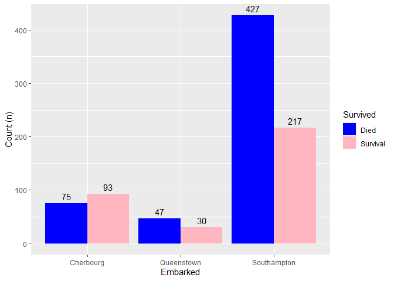
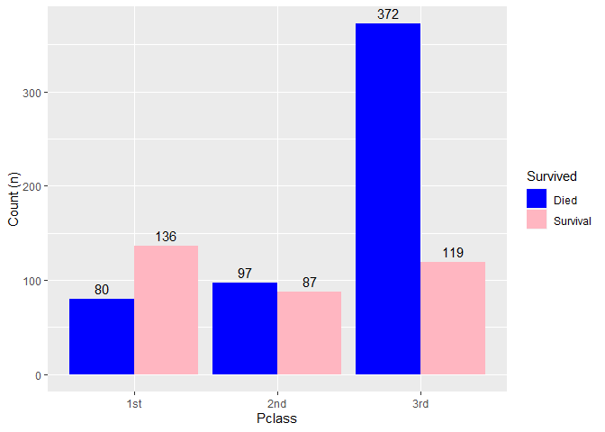
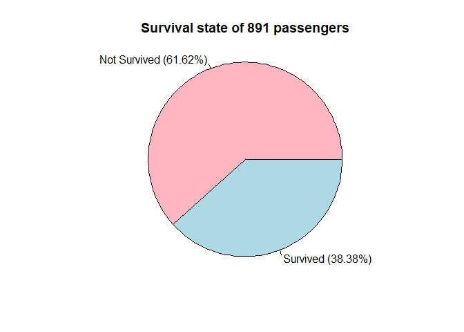
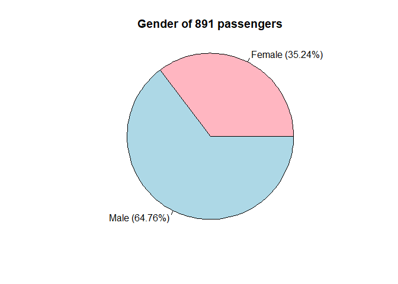
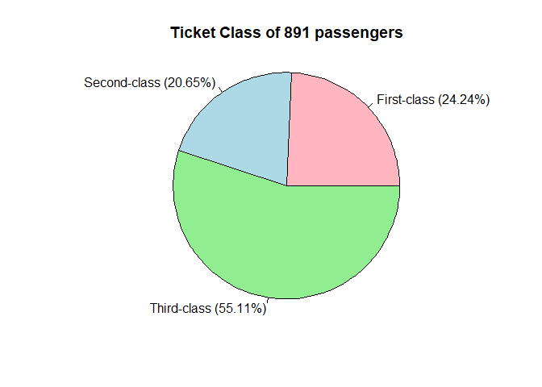
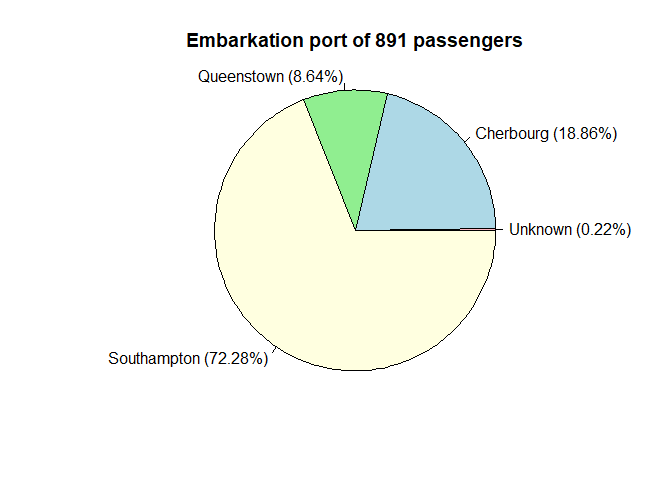
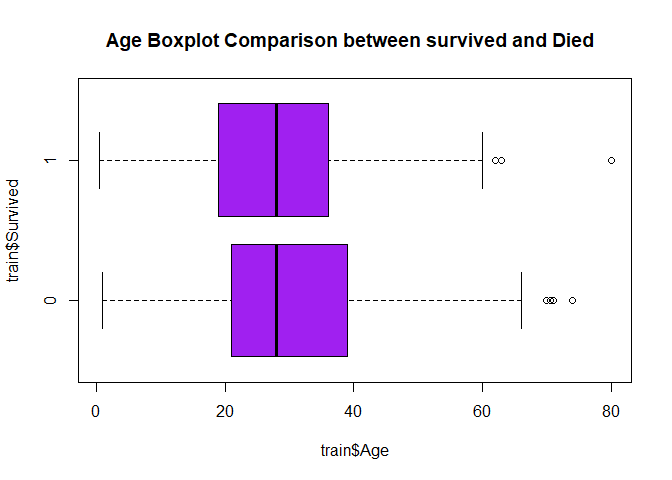
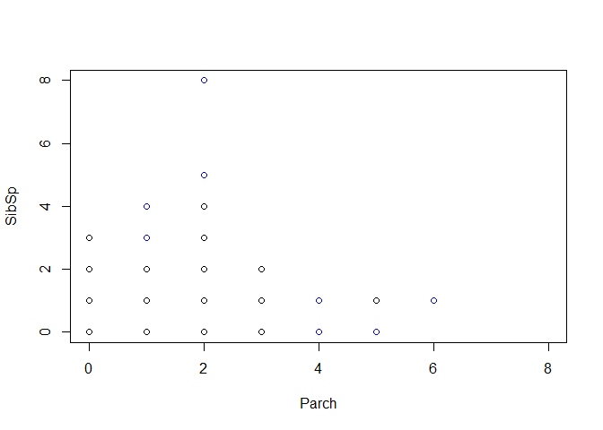
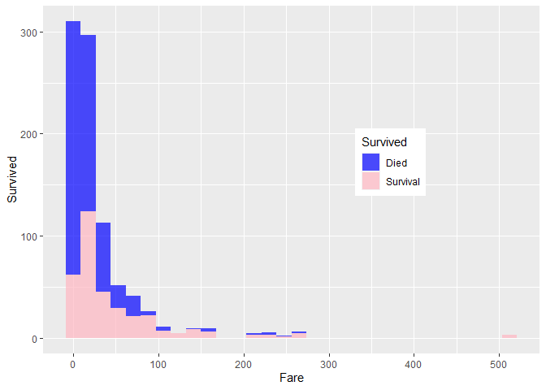

EDA_runcodeTitanic
================
2023-09-10

# Exploratory Data Analysis (EDA) to analysis Titanic data set

I think everyone used to see about incident “Sinking of Titanic” that
everyone has heard stories about, whether it be movies or
telliundefinedng stories In fact, this incident is considered one of the
greatest losses related to the shipping industry. which from incident I
starting to learn about R language

# the variable for Titanic dataset

To analyze the dataset, we have access to the Titanic dataset on Kaggle.
We will use the training dataset for exploratory data analysis (EDA) and
to answer overall questions. and the dataset has variables you can use
in analysis next steps is to show and describe about details of the
variable.

1.  **PassengerID (n)** is identified about passenger total 1 to 891.

2.  **Survived** is survival state of passenger. showing to “0” can not
    survived , “1” can survived

3.  **Pclass (ca)** is the ticket class of the passenger, in which “1”
    is first class , “2” is second class , and “3” stand for third-class
    ticket respectively.

4.  **Name (s)** of the passenger is listed as string and information to
    identify for boarding.

5.  **Sex (ca)** indicates about gender “male” and “female”.

6.  **Age (n)** shows passenger age (years).

7.  **Sibsp (n)** shows the number of siblings and spouses boarding the
    Titanic.

8.  **Parch (n)** shows the number of passenger’s parent and child
    boarding the ship.

9.  **Fare (n)** is the price of the ticket from 0.00 to 512.3292 pounds
    which the passenger purchases for boarding the Titanic.

10. **Ticket (s)** is paper to show the information about the passenger.

11. **Cabin (s)** is the **cabin number** assigned to the passenger on
    the Titanic.

12. **Embarked (c)** is the embarkation port for passengers consisting
    of three locations, which are 3 places is “C”= Cherbourg, “Q”=
    Queenstown and “S”= Southampton.

p.s. type of variable is “s” show about strings ,“n” show numeric and
“ca” stand for categorical.

## **Performing EDA with RStudio**

**and we necessary to download the dataset before, actually you can
download it from <https://www.kaggle.com/c/titanic> which has the
dataset so you can practice analysis.**

For this analysis,I use the Rstudio for analysis with R language.

## The first step, EDA analysis is preparing to installing packages and library to use.

``` r
library(ggplot2)
library(gtsummary)
library(gt)
library(webshot2)
library(tidyverse)
```

    ## ── Attaching core tidyverse packages ──────────────────────── tidyverse 2.0.0 ──
    ## ✔ dplyr     1.1.3     ✔ stringr   1.5.0
    ## ✔ forcats   1.0.0     ✔ tibble    3.2.1
    ## ✔ lubridate 1.9.2     ✔ tidyr     1.3.0
    ## ✔ purrr     1.0.2     
    ## ── Conflicts ────────────────────────────────────────── tidyverse_conflicts() ──
    ## ✖ dplyr::filter() masks stats::filter()
    ## ✖ dplyr::lag()    masks stats::lag()
    ## ℹ Use the conflicted package (<http://conflicted.r-lib.org/>) to force all conflicts to become errors

``` r
str(train)
```

    ## spc_tbl_ [891 × 12] (S3: spec_tbl_df/tbl_df/tbl/data.frame)
    ##  $ PassengerId: num [1:891] 1 2 3 4 5 6 7 8 9 10 ...
    ##  $ Survived   : num [1:891] 0 1 1 1 0 0 0 0 1 1 ...
    ##  $ Pclass     : num [1:891] 3 1 3 1 3 3 1 3 3 2 ...
    ##  $ Name       : chr [1:891] "Braund, Mr. Owen Harris" "Cumings, Mrs. John Bradley (Florence Briggs Thayer)" "Heikkinen, Miss. Laina" "Futrelle, Mrs. Jacques Heath (Lily May Peel)" ...
    ##  $ Sex        : chr [1:891] "male" "female" "female" "female" ...
    ##  $ Age        : num [1:891] 22 38 26 35 35 NA 54 2 27 14 ...
    ##  $ SibSp      : num [1:891] 1 1 0 1 0 0 0 3 0 1 ...
    ##  $ Parch      : num [1:891] 0 0 0 0 0 0 0 1 2 0 ...
    ##  $ Ticket     : chr [1:891] "A/5 21171" "PC 17599" "STON/O2. 3101282" "113803" ...
    ##  $ Fare       : num [1:891] 7.25 71.28 7.92 53.1 8.05 ...
    ##  $ Cabin      : chr [1:891] NA "C85" NA "C123" ...
    ##  $ Embarked   : chr [1:891] "S" "C" "S" "S" ...
    ##  - attr(*, "spec")=
    ##   .. cols(
    ##   ..   PassengerId = col_double(),
    ##   ..   Survived = col_double(),
    ##   ..   Pclass = col_double(),
    ##   ..   Name = col_character(),
    ##   ..   Sex = col_character(),
    ##   ..   Age = col_double(),
    ##   ..   SibSp = col_double(),
    ##   ..   Parch = col_double(),
    ##   ..   Ticket = col_character(),
    ##   ..   Fare = col_double(),
    ##   ..   Cabin = col_character(),
    ##   ..   Embarked = col_character()
    ##   .. )
    ##  - attr(*, "problems")=<externalptr>

``` r
summary(train)
```

    ##   PassengerId       Survived          Pclass          Name          
    ##  Min.   :  1.0   Min.   :0.0000   Min.   :1.000   Length:891        
    ##  1st Qu.:223.5   1st Qu.:0.0000   1st Qu.:2.000   Class :character  
    ##  Median :446.0   Median :0.0000   Median :3.000   Mode  :character  
    ##  Mean   :446.0   Mean   :0.3838   Mean   :2.309                     
    ##  3rd Qu.:668.5   3rd Qu.:1.0000   3rd Qu.:3.000                     
    ##  Max.   :891.0   Max.   :1.0000   Max.   :3.000                     
    ##                                                                     
    ##      Sex                 Age            SibSp           Parch       
    ##  Length:891         Min.   : 0.42   Min.   :0.000   Min.   :0.0000  
    ##  Class :character   1st Qu.:20.12   1st Qu.:0.000   1st Qu.:0.0000  
    ##  Mode  :character   Median :28.00   Median :0.000   Median :0.0000  
    ##                     Mean   :29.70   Mean   :0.523   Mean   :0.3816  
    ##                     3rd Qu.:38.00   3rd Qu.:1.000   3rd Qu.:0.0000  
    ##                     Max.   :80.00   Max.   :8.000   Max.   :6.0000  
    ##                     NA's   :177                                     
    ##     Ticket               Fare           Cabin             Embarked        
    ##  Length:891         Min.   :  0.00   Length:891         Length:891        
    ##  Class :character   1st Qu.:  7.91   Class :character   Class :character  
    ##  Mode  :character   Median : 14.45   Mode  :character   Mode  :character  
    ##                     Mean   : 32.20                                        
    ##                     3rd Qu.: 31.00                                        
    ##                     Max.   :512.33                                        
    ## 

<figure>

<figcaption aria-hidden="true">Fig 1 Picture show the basic
information(min,max,mean,median in numeric and length, class, mode in
string).</figcaption>
</figure>

# **Quantitative Attribute**

Quantitative data is displayed to us using the “Summary” command. We
have created a table showing the mean and SD (standard deviation) values
to give an overview of the results. Able to analyze data.

``` r
dsum <- train %>% select(Age,SibSp,Parch,Fare)
```

``` r
dsum %>% tbl_summary( type = list(SibSp ~ 'continuous',Parch ~ 'continuous'), statistic = list(all_continuous()~"{mean} ({sd})"), digits = list(all_continuous()~c(2,2)) )
```

<div id="dhquyuvghv" style="padding-left:0px;padding-right:0px;padding-top:10px;padding-bottom:10px;overflow-x:auto;overflow-y:auto;width:auto;height:auto;">
<style>#dhquyuvghv table {
  font-family: system-ui, 'Segoe UI', Roboto, Helvetica, Arial, sans-serif, 'Apple Color Emoji', 'Segoe UI Emoji', 'Segoe UI Symbol', 'Noto Color Emoji';
  -webkit-font-smoothing: antialiased;
  -moz-osx-font-smoothing: grayscale;
}
&#10;#dhquyuvghv thead, #dhquyuvghv tbody, #dhquyuvghv tfoot, #dhquyuvghv tr, #dhquyuvghv td, #dhquyuvghv th {
  border-style: none;
}
&#10;#dhquyuvghv p {
  margin: 0;
  padding: 0;
}
&#10;#dhquyuvghv .gt_table {
  display: table;
  border-collapse: collapse;
  line-height: normal;
  margin-left: auto;
  margin-right: auto;
  color: #333333;
  font-size: 16px;
  font-weight: normal;
  font-style: normal;
  background-color: #FFFFFF;
  width: auto;
  border-top-style: solid;
  border-top-width: 2px;
  border-top-color: #A8A8A8;
  border-right-style: none;
  border-right-width: 2px;
  border-right-color: #D3D3D3;
  border-bottom-style: solid;
  border-bottom-width: 2px;
  border-bottom-color: #A8A8A8;
  border-left-style: none;
  border-left-width: 2px;
  border-left-color: #D3D3D3;
}
&#10;#dhquyuvghv .gt_caption {
  padding-top: 4px;
  padding-bottom: 4px;
}
&#10;#dhquyuvghv .gt_title {
  color: #333333;
  font-size: 125%;
  font-weight: initial;
  padding-top: 4px;
  padding-bottom: 4px;
  padding-left: 5px;
  padding-right: 5px;
  border-bottom-color: #FFFFFF;
  border-bottom-width: 0;
}
&#10;#dhquyuvghv .gt_subtitle {
  color: #333333;
  font-size: 85%;
  font-weight: initial;
  padding-top: 3px;
  padding-bottom: 5px;
  padding-left: 5px;
  padding-right: 5px;
  border-top-color: #FFFFFF;
  border-top-width: 0;
}
&#10;#dhquyuvghv .gt_heading {
  background-color: #FFFFFF;
  text-align: center;
  border-bottom-color: #FFFFFF;
  border-left-style: none;
  border-left-width: 1px;
  border-left-color: #D3D3D3;
  border-right-style: none;
  border-right-width: 1px;
  border-right-color: #D3D3D3;
}
&#10;#dhquyuvghv .gt_bottom_border {
  border-bottom-style: solid;
  border-bottom-width: 2px;
  border-bottom-color: #D3D3D3;
}
&#10;#dhquyuvghv .gt_col_headings {
  border-top-style: solid;
  border-top-width: 2px;
  border-top-color: #D3D3D3;
  border-bottom-style: solid;
  border-bottom-width: 2px;
  border-bottom-color: #D3D3D3;
  border-left-style: none;
  border-left-width: 1px;
  border-left-color: #D3D3D3;
  border-right-style: none;
  border-right-width: 1px;
  border-right-color: #D3D3D3;
}
&#10;#dhquyuvghv .gt_col_heading {
  color: #333333;
  background-color: #FFFFFF;
  font-size: 100%;
  font-weight: normal;
  text-transform: inherit;
  border-left-style: none;
  border-left-width: 1px;
  border-left-color: #D3D3D3;
  border-right-style: none;
  border-right-width: 1px;
  border-right-color: #D3D3D3;
  vertical-align: bottom;
  padding-top: 5px;
  padding-bottom: 6px;
  padding-left: 5px;
  padding-right: 5px;
  overflow-x: hidden;
}
&#10;#dhquyuvghv .gt_column_spanner_outer {
  color: #333333;
  background-color: #FFFFFF;
  font-size: 100%;
  font-weight: normal;
  text-transform: inherit;
  padding-top: 0;
  padding-bottom: 0;
  padding-left: 4px;
  padding-right: 4px;
}
&#10;#dhquyuvghv .gt_column_spanner_outer:first-child {
  padding-left: 0;
}
&#10;#dhquyuvghv .gt_column_spanner_outer:last-child {
  padding-right: 0;
}
&#10;#dhquyuvghv .gt_column_spanner {
  border-bottom-style: solid;
  border-bottom-width: 2px;
  border-bottom-color: #D3D3D3;
  vertical-align: bottom;
  padding-top: 5px;
  padding-bottom: 5px;
  overflow-x: hidden;
  display: inline-block;
  width: 100%;
}
&#10;#dhquyuvghv .gt_spanner_row {
  border-bottom-style: hidden;
}
&#10;#dhquyuvghv .gt_group_heading {
  padding-top: 8px;
  padding-bottom: 8px;
  padding-left: 5px;
  padding-right: 5px;
  color: #333333;
  background-color: #FFFFFF;
  font-size: 100%;
  font-weight: initial;
  text-transform: inherit;
  border-top-style: solid;
  border-top-width: 2px;
  border-top-color: #D3D3D3;
  border-bottom-style: solid;
  border-bottom-width: 2px;
  border-bottom-color: #D3D3D3;
  border-left-style: none;
  border-left-width: 1px;
  border-left-color: #D3D3D3;
  border-right-style: none;
  border-right-width: 1px;
  border-right-color: #D3D3D3;
  vertical-align: middle;
  text-align: left;
}
&#10;#dhquyuvghv .gt_empty_group_heading {
  padding: 0.5px;
  color: #333333;
  background-color: #FFFFFF;
  font-size: 100%;
  font-weight: initial;
  border-top-style: solid;
  border-top-width: 2px;
  border-top-color: #D3D3D3;
  border-bottom-style: solid;
  border-bottom-width: 2px;
  border-bottom-color: #D3D3D3;
  vertical-align: middle;
}
&#10;#dhquyuvghv .gt_from_md > :first-child {
  margin-top: 0;
}
&#10;#dhquyuvghv .gt_from_md > :last-child {
  margin-bottom: 0;
}
&#10;#dhquyuvghv .gt_row {
  padding-top: 8px;
  padding-bottom: 8px;
  padding-left: 5px;
  padding-right: 5px;
  margin: 10px;
  border-top-style: solid;
  border-top-width: 1px;
  border-top-color: #D3D3D3;
  border-left-style: none;
  border-left-width: 1px;
  border-left-color: #D3D3D3;
  border-right-style: none;
  border-right-width: 1px;
  border-right-color: #D3D3D3;
  vertical-align: middle;
  overflow-x: hidden;
}
&#10;#dhquyuvghv .gt_stub {
  color: #333333;
  background-color: #FFFFFF;
  font-size: 100%;
  font-weight: initial;
  text-transform: inherit;
  border-right-style: solid;
  border-right-width: 2px;
  border-right-color: #D3D3D3;
  padding-left: 5px;
  padding-right: 5px;
}
&#10;#dhquyuvghv .gt_stub_row_group {
  color: #333333;
  background-color: #FFFFFF;
  font-size: 100%;
  font-weight: initial;
  text-transform: inherit;
  border-right-style: solid;
  border-right-width: 2px;
  border-right-color: #D3D3D3;
  padding-left: 5px;
  padding-right: 5px;
  vertical-align: top;
}
&#10;#dhquyuvghv .gt_row_group_first td {
  border-top-width: 2px;
}
&#10;#dhquyuvghv .gt_row_group_first th {
  border-top-width: 2px;
}
&#10;#dhquyuvghv .gt_summary_row {
  color: #333333;
  background-color: #FFFFFF;
  text-transform: inherit;
  padding-top: 8px;
  padding-bottom: 8px;
  padding-left: 5px;
  padding-right: 5px;
}
&#10;#dhquyuvghv .gt_first_summary_row {
  border-top-style: solid;
  border-top-color: #D3D3D3;
}
&#10;#dhquyuvghv .gt_first_summary_row.thick {
  border-top-width: 2px;
}
&#10;#dhquyuvghv .gt_last_summary_row {
  padding-top: 8px;
  padding-bottom: 8px;
  padding-left: 5px;
  padding-right: 5px;
  border-bottom-style: solid;
  border-bottom-width: 2px;
  border-bottom-color: #D3D3D3;
}
&#10;#dhquyuvghv .gt_grand_summary_row {
  color: #333333;
  background-color: #FFFFFF;
  text-transform: inherit;
  padding-top: 8px;
  padding-bottom: 8px;
  padding-left: 5px;
  padding-right: 5px;
}
&#10;#dhquyuvghv .gt_first_grand_summary_row {
  padding-top: 8px;
  padding-bottom: 8px;
  padding-left: 5px;
  padding-right: 5px;
  border-top-style: double;
  border-top-width: 6px;
  border-top-color: #D3D3D3;
}
&#10;#dhquyuvghv .gt_last_grand_summary_row_top {
  padding-top: 8px;
  padding-bottom: 8px;
  padding-left: 5px;
  padding-right: 5px;
  border-bottom-style: double;
  border-bottom-width: 6px;
  border-bottom-color: #D3D3D3;
}
&#10;#dhquyuvghv .gt_striped {
  background-color: rgba(128, 128, 128, 0.05);
}
&#10;#dhquyuvghv .gt_table_body {
  border-top-style: solid;
  border-top-width: 2px;
  border-top-color: #D3D3D3;
  border-bottom-style: solid;
  border-bottom-width: 2px;
  border-bottom-color: #D3D3D3;
}
&#10;#dhquyuvghv .gt_footnotes {
  color: #333333;
  background-color: #FFFFFF;
  border-bottom-style: none;
  border-bottom-width: 2px;
  border-bottom-color: #D3D3D3;
  border-left-style: none;
  border-left-width: 2px;
  border-left-color: #D3D3D3;
  border-right-style: none;
  border-right-width: 2px;
  border-right-color: #D3D3D3;
}
&#10;#dhquyuvghv .gt_footnote {
  margin: 0px;
  font-size: 90%;
  padding-top: 4px;
  padding-bottom: 4px;
  padding-left: 5px;
  padding-right: 5px;
}
&#10;#dhquyuvghv .gt_sourcenotes {
  color: #333333;
  background-color: #FFFFFF;
  border-bottom-style: none;
  border-bottom-width: 2px;
  border-bottom-color: #D3D3D3;
  border-left-style: none;
  border-left-width: 2px;
  border-left-color: #D3D3D3;
  border-right-style: none;
  border-right-width: 2px;
  border-right-color: #D3D3D3;
}
&#10;#dhquyuvghv .gt_sourcenote {
  font-size: 90%;
  padding-top: 4px;
  padding-bottom: 4px;
  padding-left: 5px;
  padding-right: 5px;
}
&#10;#dhquyuvghv .gt_left {
  text-align: left;
}
&#10;#dhquyuvghv .gt_center {
  text-align: center;
}
&#10;#dhquyuvghv .gt_right {
  text-align: right;
  font-variant-numeric: tabular-nums;
}
&#10;#dhquyuvghv .gt_font_normal {
  font-weight: normal;
}
&#10;#dhquyuvghv .gt_font_bold {
  font-weight: bold;
}
&#10;#dhquyuvghv .gt_font_italic {
  font-style: italic;
}
&#10;#dhquyuvghv .gt_super {
  font-size: 65%;
}
&#10;#dhquyuvghv .gt_footnote_marks {
  font-size: 75%;
  vertical-align: 0.4em;
  position: initial;
}
&#10;#dhquyuvghv .gt_asterisk {
  font-size: 100%;
  vertical-align: 0;
}
&#10;#dhquyuvghv .gt_indent_1 {
  text-indent: 5px;
}
&#10;#dhquyuvghv .gt_indent_2 {
  text-indent: 10px;
}
&#10;#dhquyuvghv .gt_indent_3 {
  text-indent: 15px;
}
&#10;#dhquyuvghv .gt_indent_4 {
  text-indent: 20px;
}
&#10;#dhquyuvghv .gt_indent_5 {
  text-indent: 25px;
}
</style>
<table class="gt_table" data-quarto-disable-processing="false" data-quarto-bootstrap="false">
  <thead>
    &#10;    <tr class="gt_col_headings">
      <th class="gt_col_heading gt_columns_bottom_border gt_left" rowspan="1" colspan="1" scope="col" id="&lt;strong&gt;Characteristic&lt;/strong&gt;"><strong>Characteristic</strong></th>
      <th class="gt_col_heading gt_columns_bottom_border gt_center" rowspan="1" colspan="1" scope="col" id="&lt;strong&gt;N = 891&lt;/strong&gt;&lt;span class=&quot;gt_footnote_marks&quot; style=&quot;white-space:nowrap;font-style:italic;font-weight:normal;&quot;&gt;&lt;sup&gt;1&lt;/sup&gt;&lt;/span&gt;"><strong>N = 891</strong><span class="gt_footnote_marks" style="white-space:nowrap;font-style:italic;font-weight:normal;"><sup>1</sup></span></th>
    </tr>
  </thead>
  <tbody class="gt_table_body">
    <tr><td headers="label" class="gt_row gt_left">Age</td>
<td headers="stat_0" class="gt_row gt_center">29.70 (14.53)</td></tr>
    <tr><td headers="label" class="gt_row gt_left">    Unknown</td>
<td headers="stat_0" class="gt_row gt_center">177</td></tr>
    <tr><td headers="label" class="gt_row gt_left">SibSp</td>
<td headers="stat_0" class="gt_row gt_center">0.52 (1.10)</td></tr>
    <tr><td headers="label" class="gt_row gt_left">Parch</td>
<td headers="stat_0" class="gt_row gt_center">0.38 (0.81)</td></tr>
    <tr><td headers="label" class="gt_row gt_left">Fare</td>
<td headers="stat_0" class="gt_row gt_center">32.20 (49.69)</td></tr>
  </tbody>
  &#10;  <tfoot class="gt_footnotes">
    <tr>
      <td class="gt_footnote" colspan="2"><span class="gt_footnote_marks" style="white-space:nowrap;font-style:italic;font-weight:normal;"><sup>1</sup></span> Mean (SD)</td>
    </tr>
  </tfoot>
</table>
</div>

Table 1 shows the means and SD of the selected variables.

Based on the given value,

1.  Can be observed that the age mean is 27.90 (years) SD = 14.53 can
    show the more of distribute in range of age ,The above information
    makes it clear that there are passengers of various ages who come on
    board for whatever reason.
2.  SibSp mean = 0.52 SD =1.10 It shows that in boarding the ship this
    time, there were rarely a group of people who were related in terms
    of relatives boarding the ship together and Parch mean = 0.38 SD =
    0.81 is can be interpreted in the same way
3.  Fare mean = 32.20 SD = 49.69 it show more of distribute in the range
    of fare because data classify by the 1st, 2nd, 3rd class of ticket
    passenger.

Table showing percent of survival relates with various variable

- The survived for the incident which all of the passenger is 891 , and
  then the survived is 342, not survived is 549
- Most of the passengers who died purchased third-class tickets.
- there were more males than females on the boat, The proportion of
  males who died was also higher.

``` r
qual <- train %>% select(Survived,Pclass,Sex,Embarked) 
# summarize into a table 
qual %>% tbl_summary( digits = list(all_categorical()~c(2,2)) )
```

<div id="rmbslwpafw" style="padding-left:0px;padding-right:0px;padding-top:10px;padding-bottom:10px;overflow-x:auto;overflow-y:auto;width:auto;height:auto;">
<style>#rmbslwpafw table {
  font-family: system-ui, 'Segoe UI', Roboto, Helvetica, Arial, sans-serif, 'Apple Color Emoji', 'Segoe UI Emoji', 'Segoe UI Symbol', 'Noto Color Emoji';
  -webkit-font-smoothing: antialiased;
  -moz-osx-font-smoothing: grayscale;
}
&#10;#rmbslwpafw thead, #rmbslwpafw tbody, #rmbslwpafw tfoot, #rmbslwpafw tr, #rmbslwpafw td, #rmbslwpafw th {
  border-style: none;
}
&#10;#rmbslwpafw p {
  margin: 0;
  padding: 0;
}
&#10;#rmbslwpafw .gt_table {
  display: table;
  border-collapse: collapse;
  line-height: normal;
  margin-left: auto;
  margin-right: auto;
  color: #333333;
  font-size: 16px;
  font-weight: normal;
  font-style: normal;
  background-color: #FFFFFF;
  width: auto;
  border-top-style: solid;
  border-top-width: 2px;
  border-top-color: #A8A8A8;
  border-right-style: none;
  border-right-width: 2px;
  border-right-color: #D3D3D3;
  border-bottom-style: solid;
  border-bottom-width: 2px;
  border-bottom-color: #A8A8A8;
  border-left-style: none;
  border-left-width: 2px;
  border-left-color: #D3D3D3;
}
&#10;#rmbslwpafw .gt_caption {
  padding-top: 4px;
  padding-bottom: 4px;
}
&#10;#rmbslwpafw .gt_title {
  color: #333333;
  font-size: 125%;
  font-weight: initial;
  padding-top: 4px;
  padding-bottom: 4px;
  padding-left: 5px;
  padding-right: 5px;
  border-bottom-color: #FFFFFF;
  border-bottom-width: 0;
}
&#10;#rmbslwpafw .gt_subtitle {
  color: #333333;
  font-size: 85%;
  font-weight: initial;
  padding-top: 3px;
  padding-bottom: 5px;
  padding-left: 5px;
  padding-right: 5px;
  border-top-color: #FFFFFF;
  border-top-width: 0;
}
&#10;#rmbslwpafw .gt_heading {
  background-color: #FFFFFF;
  text-align: center;
  border-bottom-color: #FFFFFF;
  border-left-style: none;
  border-left-width: 1px;
  border-left-color: #D3D3D3;
  border-right-style: none;
  border-right-width: 1px;
  border-right-color: #D3D3D3;
}
&#10;#rmbslwpafw .gt_bottom_border {
  border-bottom-style: solid;
  border-bottom-width: 2px;
  border-bottom-color: #D3D3D3;
}
&#10;#rmbslwpafw .gt_col_headings {
  border-top-style: solid;
  border-top-width: 2px;
  border-top-color: #D3D3D3;
  border-bottom-style: solid;
  border-bottom-width: 2px;
  border-bottom-color: #D3D3D3;
  border-left-style: none;
  border-left-width: 1px;
  border-left-color: #D3D3D3;
  border-right-style: none;
  border-right-width: 1px;
  border-right-color: #D3D3D3;
}
&#10;#rmbslwpafw .gt_col_heading {
  color: #333333;
  background-color: #FFFFFF;
  font-size: 100%;
  font-weight: normal;
  text-transform: inherit;
  border-left-style: none;
  border-left-width: 1px;
  border-left-color: #D3D3D3;
  border-right-style: none;
  border-right-width: 1px;
  border-right-color: #D3D3D3;
  vertical-align: bottom;
  padding-top: 5px;
  padding-bottom: 6px;
  padding-left: 5px;
  padding-right: 5px;
  overflow-x: hidden;
}
&#10;#rmbslwpafw .gt_column_spanner_outer {
  color: #333333;
  background-color: #FFFFFF;
  font-size: 100%;
  font-weight: normal;
  text-transform: inherit;
  padding-top: 0;
  padding-bottom: 0;
  padding-left: 4px;
  padding-right: 4px;
}
&#10;#rmbslwpafw .gt_column_spanner_outer:first-child {
  padding-left: 0;
}
&#10;#rmbslwpafw .gt_column_spanner_outer:last-child {
  padding-right: 0;
}
&#10;#rmbslwpafw .gt_column_spanner {
  border-bottom-style: solid;
  border-bottom-width: 2px;
  border-bottom-color: #D3D3D3;
  vertical-align: bottom;
  padding-top: 5px;
  padding-bottom: 5px;
  overflow-x: hidden;
  display: inline-block;
  width: 100%;
}
&#10;#rmbslwpafw .gt_spanner_row {
  border-bottom-style: hidden;
}
&#10;#rmbslwpafw .gt_group_heading {
  padding-top: 8px;
  padding-bottom: 8px;
  padding-left: 5px;
  padding-right: 5px;
  color: #333333;
  background-color: #FFFFFF;
  font-size: 100%;
  font-weight: initial;
  text-transform: inherit;
  border-top-style: solid;
  border-top-width: 2px;
  border-top-color: #D3D3D3;
  border-bottom-style: solid;
  border-bottom-width: 2px;
  border-bottom-color: #D3D3D3;
  border-left-style: none;
  border-left-width: 1px;
  border-left-color: #D3D3D3;
  border-right-style: none;
  border-right-width: 1px;
  border-right-color: #D3D3D3;
  vertical-align: middle;
  text-align: left;
}
&#10;#rmbslwpafw .gt_empty_group_heading {
  padding: 0.5px;
  color: #333333;
  background-color: #FFFFFF;
  font-size: 100%;
  font-weight: initial;
  border-top-style: solid;
  border-top-width: 2px;
  border-top-color: #D3D3D3;
  border-bottom-style: solid;
  border-bottom-width: 2px;
  border-bottom-color: #D3D3D3;
  vertical-align: middle;
}
&#10;#rmbslwpafw .gt_from_md > :first-child {
  margin-top: 0;
}
&#10;#rmbslwpafw .gt_from_md > :last-child {
  margin-bottom: 0;
}
&#10;#rmbslwpafw .gt_row {
  padding-top: 8px;
  padding-bottom: 8px;
  padding-left: 5px;
  padding-right: 5px;
  margin: 10px;
  border-top-style: solid;
  border-top-width: 1px;
  border-top-color: #D3D3D3;
  border-left-style: none;
  border-left-width: 1px;
  border-left-color: #D3D3D3;
  border-right-style: none;
  border-right-width: 1px;
  border-right-color: #D3D3D3;
  vertical-align: middle;
  overflow-x: hidden;
}
&#10;#rmbslwpafw .gt_stub {
  color: #333333;
  background-color: #FFFFFF;
  font-size: 100%;
  font-weight: initial;
  text-transform: inherit;
  border-right-style: solid;
  border-right-width: 2px;
  border-right-color: #D3D3D3;
  padding-left: 5px;
  padding-right: 5px;
}
&#10;#rmbslwpafw .gt_stub_row_group {
  color: #333333;
  background-color: #FFFFFF;
  font-size: 100%;
  font-weight: initial;
  text-transform: inherit;
  border-right-style: solid;
  border-right-width: 2px;
  border-right-color: #D3D3D3;
  padding-left: 5px;
  padding-right: 5px;
  vertical-align: top;
}
&#10;#rmbslwpafw .gt_row_group_first td {
  border-top-width: 2px;
}
&#10;#rmbslwpafw .gt_row_group_first th {
  border-top-width: 2px;
}
&#10;#rmbslwpafw .gt_summary_row {
  color: #333333;
  background-color: #FFFFFF;
  text-transform: inherit;
  padding-top: 8px;
  padding-bottom: 8px;
  padding-left: 5px;
  padding-right: 5px;
}
&#10;#rmbslwpafw .gt_first_summary_row {
  border-top-style: solid;
  border-top-color: #D3D3D3;
}
&#10;#rmbslwpafw .gt_first_summary_row.thick {
  border-top-width: 2px;
}
&#10;#rmbslwpafw .gt_last_summary_row {
  padding-top: 8px;
  padding-bottom: 8px;
  padding-left: 5px;
  padding-right: 5px;
  border-bottom-style: solid;
  border-bottom-width: 2px;
  border-bottom-color: #D3D3D3;
}
&#10;#rmbslwpafw .gt_grand_summary_row {
  color: #333333;
  background-color: #FFFFFF;
  text-transform: inherit;
  padding-top: 8px;
  padding-bottom: 8px;
  padding-left: 5px;
  padding-right: 5px;
}
&#10;#rmbslwpafw .gt_first_grand_summary_row {
  padding-top: 8px;
  padding-bottom: 8px;
  padding-left: 5px;
  padding-right: 5px;
  border-top-style: double;
  border-top-width: 6px;
  border-top-color: #D3D3D3;
}
&#10;#rmbslwpafw .gt_last_grand_summary_row_top {
  padding-top: 8px;
  padding-bottom: 8px;
  padding-left: 5px;
  padding-right: 5px;
  border-bottom-style: double;
  border-bottom-width: 6px;
  border-bottom-color: #D3D3D3;
}
&#10;#rmbslwpafw .gt_striped {
  background-color: rgba(128, 128, 128, 0.05);
}
&#10;#rmbslwpafw .gt_table_body {
  border-top-style: solid;
  border-top-width: 2px;
  border-top-color: #D3D3D3;
  border-bottom-style: solid;
  border-bottom-width: 2px;
  border-bottom-color: #D3D3D3;
}
&#10;#rmbslwpafw .gt_footnotes {
  color: #333333;
  background-color: #FFFFFF;
  border-bottom-style: none;
  border-bottom-width: 2px;
  border-bottom-color: #D3D3D3;
  border-left-style: none;
  border-left-width: 2px;
  border-left-color: #D3D3D3;
  border-right-style: none;
  border-right-width: 2px;
  border-right-color: #D3D3D3;
}
&#10;#rmbslwpafw .gt_footnote {
  margin: 0px;
  font-size: 90%;
  padding-top: 4px;
  padding-bottom: 4px;
  padding-left: 5px;
  padding-right: 5px;
}
&#10;#rmbslwpafw .gt_sourcenotes {
  color: #333333;
  background-color: #FFFFFF;
  border-bottom-style: none;
  border-bottom-width: 2px;
  border-bottom-color: #D3D3D3;
  border-left-style: none;
  border-left-width: 2px;
  border-left-color: #D3D3D3;
  border-right-style: none;
  border-right-width: 2px;
  border-right-color: #D3D3D3;
}
&#10;#rmbslwpafw .gt_sourcenote {
  font-size: 90%;
  padding-top: 4px;
  padding-bottom: 4px;
  padding-left: 5px;
  padding-right: 5px;
}
&#10;#rmbslwpafw .gt_left {
  text-align: left;
}
&#10;#rmbslwpafw .gt_center {
  text-align: center;
}
&#10;#rmbslwpafw .gt_right {
  text-align: right;
  font-variant-numeric: tabular-nums;
}
&#10;#rmbslwpafw .gt_font_normal {
  font-weight: normal;
}
&#10;#rmbslwpafw .gt_font_bold {
  font-weight: bold;
}
&#10;#rmbslwpafw .gt_font_italic {
  font-style: italic;
}
&#10;#rmbslwpafw .gt_super {
  font-size: 65%;
}
&#10;#rmbslwpafw .gt_footnote_marks {
  font-size: 75%;
  vertical-align: 0.4em;
  position: initial;
}
&#10;#rmbslwpafw .gt_asterisk {
  font-size: 100%;
  vertical-align: 0;
}
&#10;#rmbslwpafw .gt_indent_1 {
  text-indent: 5px;
}
&#10;#rmbslwpafw .gt_indent_2 {
  text-indent: 10px;
}
&#10;#rmbslwpafw .gt_indent_3 {
  text-indent: 15px;
}
&#10;#rmbslwpafw .gt_indent_4 {
  text-indent: 20px;
}
&#10;#rmbslwpafw .gt_indent_5 {
  text-indent: 25px;
}
</style>
<table class="gt_table" data-quarto-disable-processing="false" data-quarto-bootstrap="false">
  <thead>
    &#10;    <tr class="gt_col_headings">
      <th class="gt_col_heading gt_columns_bottom_border gt_left" rowspan="1" colspan="1" scope="col" id="&lt;strong&gt;Characteristic&lt;/strong&gt;"><strong>Characteristic</strong></th>
      <th class="gt_col_heading gt_columns_bottom_border gt_center" rowspan="1" colspan="1" scope="col" id="&lt;strong&gt;N = 891&lt;/strong&gt;&lt;span class=&quot;gt_footnote_marks&quot; style=&quot;white-space:nowrap;font-style:italic;font-weight:normal;&quot;&gt;&lt;sup&gt;1&lt;/sup&gt;&lt;/span&gt;"><strong>N = 891</strong><span class="gt_footnote_marks" style="white-space:nowrap;font-style:italic;font-weight:normal;"><sup>1</sup></span></th>
    </tr>
  </thead>
  <tbody class="gt_table_body">
    <tr><td headers="label" class="gt_row gt_left">Survived</td>
<td headers="stat_0" class="gt_row gt_center">342.00 (38.38%)</td></tr>
    <tr><td headers="label" class="gt_row gt_left">Pclass</td>
<td headers="stat_0" class="gt_row gt_center"></td></tr>
    <tr><td headers="label" class="gt_row gt_left">    1</td>
<td headers="stat_0" class="gt_row gt_center">216.00 (24.24%)</td></tr>
    <tr><td headers="label" class="gt_row gt_left">    2</td>
<td headers="stat_0" class="gt_row gt_center">184.00 (20.65%)</td></tr>
    <tr><td headers="label" class="gt_row gt_left">    3</td>
<td headers="stat_0" class="gt_row gt_center">491.00 (55.11%)</td></tr>
    <tr><td headers="label" class="gt_row gt_left">Sex</td>
<td headers="stat_0" class="gt_row gt_center"></td></tr>
    <tr><td headers="label" class="gt_row gt_left">    female</td>
<td headers="stat_0" class="gt_row gt_center">314.00 (35.24%)</td></tr>
    <tr><td headers="label" class="gt_row gt_left">    male</td>
<td headers="stat_0" class="gt_row gt_center">577.00 (64.76%)</td></tr>
    <tr><td headers="label" class="gt_row gt_left">Embarked</td>
<td headers="stat_0" class="gt_row gt_center"></td></tr>
    <tr><td headers="label" class="gt_row gt_left">    C</td>
<td headers="stat_0" class="gt_row gt_center">168.00 (18.90%)</td></tr>
    <tr><td headers="label" class="gt_row gt_left">    Q</td>
<td headers="stat_0" class="gt_row gt_center">77.00 (8.66%)</td></tr>
    <tr><td headers="label" class="gt_row gt_left">    S</td>
<td headers="stat_0" class="gt_row gt_center">644.00 (72.44%)</td></tr>
    <tr><td headers="label" class="gt_row gt_left">    Unknown</td>
<td headers="stat_0" class="gt_row gt_center">2</td></tr>
  </tbody>
  &#10;  <tfoot class="gt_footnotes">
    <tr>
      <td class="gt_footnote" colspan="2"><span class="gt_footnote_marks" style="white-space:nowrap;font-style:italic;font-weight:normal;"><sup>1</sup></span> n (%)</td>
    </tr>
  </tfoot>
</table>
</div>

Table 2, picture show the percent for calculation about the number of
survived, Pclass,Sex,Embarked

You can observe by this numerical presentation tell us that :

- From 891 passengers just have 342 (38.38%) can survived from the
  incident.

- The most of passenger buy third-class ticket (55.11%).

- The number of male (64.76) who boarded the ship outnumbered the female
  (35.24).

## Built datafram about group interested data.

``` r
sum <- train %>%
  select(Survived, Pclass, Sex, Age, SibSp, Parch, Fare, Embarked) %>%
  mutate(
    Pclass = case_when(Pclass == "1" ~ "1st",
                       Pclass == "2" ~ "2nd",
                       Pclass == "3" ~ "3rd")
    )
print(sum)
```

    ## # A tibble: 891 × 8
    ##    Survived Pclass Sex      Age SibSp Parch  Fare Embarked
    ##       <dbl> <chr>  <chr>  <dbl> <dbl> <dbl> <dbl> <chr>   
    ##  1        0 3rd    male      22     1     0  7.25 S       
    ##  2        1 1st    female    38     1     0 71.3  C       
    ##  3        1 3rd    female    26     0     0  7.92 S       
    ##  4        1 1st    female    35     1     0 53.1  S       
    ##  5        0 3rd    male      35     0     0  8.05 S       
    ##  6        0 3rd    male      NA     0     0  8.46 Q       
    ##  7        0 1st    male      54     0     0 51.9  S       
    ##  8        0 3rd    male       2     3     1 21.1  S       
    ##  9        1 3rd    female    27     0     2 11.1  S       
    ## 10        1 2nd    female    14     1     0 30.1  C       
    ## # ℹ 881 more rows

Fig.2 picture show selection data (Survived, Pclass, Sex, Age, SibSp,
Parch, Fare, Embarked) to for create graph.

``` r
choose <- train %>%
  select(Survived, Pclass, Sex, Fare, Embarked) %>%
  mutate(
    Pclass = case_when(Pclass == "1" ~ "1st",
                       Pclass == "2" ~ "2nd",
                       Pclass == "3" ~ "3rd")
    )
```

``` r
train %>%
  count(Pclass) %>%
  mutate(sperc1 = round(n/sum(n)*100))
```

    ## # A tibble: 3 × 3
    ##   Pclass     n sperc1
    ##    <dbl> <int>  <dbl>
    ## 1      1   216     24
    ## 2      2   184     21
    ## 3      3   491     55

``` r
train %>%
  count(Sex) %>%
  mutate(sperc2 = round(n/sum(n)*100))
```

    ## # A tibble: 2 × 3
    ##   Sex        n sperc2
    ##   <chr>  <int>  <dbl>
    ## 1 female   314     35
    ## 2 male     577     65

``` r
gender <- train %>%
  group_by(Sex) %>%
  count(Survived)

ggplot(gender, aes(x = Sex, y = n, fill = as.factor(Survived))) +
  geom_bar(position="dodge", stat = "identity") +
  geom_text(aes(label = n), vjust = -0.5,
            position = position_dodge(width = 0.9)) +
  ylab("Count (n)") +
  labs(fill = "Survived") +
  scale_fill_manual(values = c("blue", "lightpink"),
                    label = c("Died","Survival" )) +
  scale_x_discrete(label = c("female" = "Female", "male" = "Male"))
```

<!-- -->

Fig 3 The bar graph show compare between Age and Survive

Fig 3 Because the number of males who board the boats is twice as many
as females, the death rate among males is higher than that of females.
which makes it known that in those days males often had opportunities in
various things more than female.

``` r
port <- train %>%
  group_by(Embarked) %>%
  count(Survived)
port <- na.omit(port)

ggplot(port, aes(x = Embarked, y = n, fill = as.factor(Survived))) +
  geom_bar(position = "dodge", stat = "identity") +
  geom_text(aes(label = n),vjust = -0.5, 
            position = position_dodge(width = 0.9)) +
  ylab("Count (n)") +
  labs(fill = "Survived") +
  scale_fill_manual(values = c("blue", "lightpink"),
                    label = c("Died","Survival" )) +
  scale_x_discrete(label = c("C" = "Cherbourg","Q" = "Queenstown",
                             "S" = "Southampton")) 
```

<!-- -->
Fig 4 The bar graph shows the ports where passengers boarded the
Titanic, three ports that were associated with the survival or death
rate of passengers

``` r
train %>%
  count(Pclass) %>%
  mutate(tpct = round(n/sum(n)*100))
```

    ## # A tibble: 3 × 3
    ##   Pclass     n  tpct
    ##    <dbl> <int> <dbl>
    ## 1      1   216    24
    ## 2      2   184    21
    ## 3      3   491    55

``` r
ticket <- train %>%
  group_by(Pclass) %>%
  count(Survived)

ggplot(ticket, aes(x = as.factor(Pclass), y = n, fill = as.factor(Survived))) +
  geom_bar(position = "dodge", stat = "identity") +
  geom_text(aes(label = n),vjust = -0.5, 
            position = position_dodge(width = 0.9)) +
  xlab("Pclass") +
  ylab("Count (n)") +
  labs(fill = "Survived") +
  scale_fill_manual(values = c("blue", "lightpink"),
                    label = c("Died","Survival" )) +
  scale_x_discrete(label = c("1" = "1st", "2" = "2nd", "3" = "3rd"))
```

<!-- -->
Fig 5 The bar graph show compare between Pclass and Survived

Fig 5 The graph shows the number of survivors and non-survivors. that
have purchased tickets for all three classes ( first class,second class
and third class) ,shows that most deceased people choose to purchase
tickets in third class.

# Qualitative Attributes

Before that we examine the relationship between quantitative variables
and passenger survival. There are four qualitative variables in the
Titanic dataset that we can examine with statistics — Survived, Pclass,
Sex, Embarked. without regard to PassengerID, Name , Cabin and Ticket

``` r
su <- c(549,342 )
labels <- c( "Not Survived (61.62%)","Survived (38.38%)")
pie(su,labels,radius = 1,main = "Survival state of 891 passengers",col =c("lightpink","lightblue"))
```

<!-- -->

Fig 6 show pie chart about number of survivor and non survivor.

``` r
gen <- c(314,577)
labels <- c("Female (35.24%)", "Male (64.76%)")
pie(gen,labels,radius = 1,main = "Gender of 891 passengers",col =c("lightpink","lightblue"))
```

<!-- -->
Fig 7 show pie chart about number of males and females.

``` r
cl <- c(216,184,491)
labels <- c("First-class (24.24%)", "Second-class (20.65%)","Third-class (55.11%)")
pie(cl,labels,radius = 1,main = "Ticket Class of 891 passengers",col =c("lightpink","lightblue","lightgreen"))
```

<!-- -->

Fig 7 show pie chart about ticket class to passenger purchase.

``` r
e <- c(2,168,77,549 )
labels <- c("Unknown (0.22%)", "Cherbourg (18.86%)"," Queenstown (8.64%)","Southampton (72.28%)")
pie(e,labels,radius=1,main = "Embarkation port of 891 passengers",col =c("lightpink","lightblue","lightgreen","lightyellow"))
```

<!-- -->

Fig 8 shows a pie chart of three ports where passengers boarded the
Titanic.

# Predictive analysis

``` r
boxplot(train$Age ~ train$Survived, main = "Age Boxplot Comparison between survived and Died  ", col = "purple", border = "black", horizontal = T, notch = F )
```

<!-- -->
Fig 9 The boxplot show compare between Age and Survived

Fig 9 The boxplot graph is a comparison between the age and survival of
the passengers. It shows that the ranges are quite similar. This makes
it impossible to determine whether age had a significant relationship
with the survival of people on the Titanic.

``` r
sur <- subset(train, Survived==0)

dy <- subset(train, Survived==1)

with(sur, plot(Parch,SibSp,col="blue", xlim=c(0,8), ylim=c(0,8)))
with(dy, points(Parch,SibSp,col="black"))
```

<!-- -->
Fig 10 The scatter plot show compare between SibSp,Parch and Survived

Fig 10 show the survivor is highlighted with blue dot, amplified by
color, while the non-survivors are painted black.

- if you look at the Parch axis, if a passenger has between one and
  three parents on board, they have a better chance of survival. Range
  greater than 3 or more because if there are a large number of family
  members The chance of helping is reduced and if you look at the SibSp
  axis, passengers with 1-2 siblings/spouses are more likely to survive.
  Because they will be helped by their lovers and brothers/sisters.

``` r
life <- train %>%
  filter(!is.na(Age))

ggplot(life, aes(x = Age)) +
  geom_density(aes(fill = as.factor(Survived)), alpha = 0.6) +
  scale_fill_manual(values = c("blue", "lightpink"),
                    label = c("Died","Survival" )) +
  theme(legend.position = c(0.85, 0.55),
        legend.background = element_rect(fill = "white", 
                                         color = "black")) +
  xlab("Age (Years)") +
  ylab("Density") +
  labs(fill = "Survived")
```

<!-- -->
Fig 11 The multi-density chart shows the distribution of age of survivor
and non-survivor passengers

Fig 11 Shows the age distribution of passengers who survived compared to
passengers who did not. The average age of both groups was 28 years
(mean = 27.90 years). Passengers younger than 15 years had a higher
chance of survival. It may indicate that children More likely to survive
For passengers aged 10-30 years and older than 60 years, the number of
passengers who survived was less.

``` r
ggplot(train, aes(x = Fare)) +
  geom_histogram(aes(fill = as.factor(Survived)),alpha = 0.7) +
  scale_fill_manual(values = c("blue", "lightpink"),
                    label = c("Died","Survival" )) +
  theme(legend.position = c(0.7, 0.55)) +
  ylab("Survived") +
  labs(fill = "Survived") 
```

    ## `stat_bin()` using `bins = 30`. Pick better value with `binwidth`.

<!-- -->
Fig 12 The histogram plot shows the distribution of fare of survivor and
non-survivor passengers.

Fig 12 Graph showing the number of survivors relative to the ticket
price for each tier, in the range 0 - £512.3292.

# Summary

In this study, an attempt was made to get to know the information. Able
to convey information in various formats to suit Because in choosing the
format for presentation is also important. All available data is able to
reflect the life and non-life history of the Titanic sinking.

I hope this is a good start for me and you who read this.

Thanks you, Soontarephan
