# Exploratory Data Analysis (EDA) to analysis Titanic data set

I think everyone used to see about incident "Sinking of Titanic" that everyone has heard stories about, whether it be movies or telliundefinedng stories In fact, this incident is considered one of the greatest losses related to the shipping industry. which from incident I starting to learn about R language

# the variable for Titanic dataset

To analyze the dataset, we have access to the Titanic dataset on Kaggle. We will use the training dataset for exploratory data analysis (EDA) and to answer overall questions. and the dataset has variables you can use in analysis next steps is to show and describe about details of the variable.

1.  **PassengerID (n)** is identified about passenger total 1 to 891.

2.  **Survived** is survival state of passenger. showing to "0" can not survived , "1" can survived

3.  **Pclass (ca)** is the ticket class of the passenger, in which "1" is first class , "2" is second class , and "3" stand for third-class ticket respectively.

4.  **Name (s)** of the passenger is listed as string and information to identify for boarding.

5.  **Sex (ca)** indicates about gender "male" and "female".

6.  **Age (n)** shows passenger age (years).

7.  **Sibsp (n)** shows the number of siblings and spouses boarding the Titanic.

8.  **Parch (n)** shows the number of passenger's parent and child boarding the ship.

9.  **Fare (n)** is the price of the ticket from 0.00 to 512.3292 pounds which the passenger purchases for boarding the Titanic.

10. **Ticket (s)** is paper to show the information about the passenger.

11. **Cabin (s)** is the **cabin number** assigned to the passenger on the Titanic.

12. **Embarked (c)** is the embarkation port for passengers consisting of three locations, which are 3 places is "C"= Cherbourg, "Q"= Queenstown and "S"= Southampton.

p.s. type of variable is "s" show about strings ,"n" show numeric and "ca" stand for categorical.

## **Performing EDA with RStudio**

**and we necessary to download the dataset before, actually you can download it from <https://www.kaggle.com/c/titanic> which has the dataset so you can practice analysis.**

For this analysis,I use the Rstudio for analysis with R language.

```{r setup, include=FALSE}
knitr::opts_chunk$set(echo = TRUE)
library(readr)
train <- read_csv("F:/Users/WINDOWS 10/Downloads/train.csv")
```

## The first step, EDA analysis is preparing to installing packages and library to use.

```{r install packages}
install.packages("ggplot2")
install.packages("gtsummary")
install.packages("gt")
install.packages("dplyr")
install.packages("webshot2")
install.packages("tidyverse")

```

```{r load library}
library(ggplot2)
library(gtsummary)
library(gt)
library(dplyr)
library(webshot2)
library(tidyverse)
```

```{r for check about detail of 12 variables}
str(train)
```

```{r summarize the dataset}
summary(train)
```

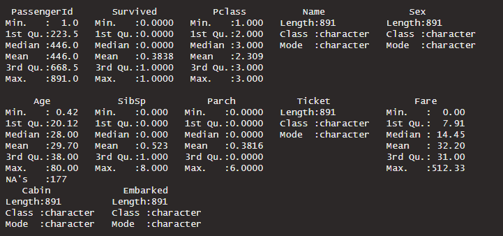{width="500"}

# **Quantitative Attribute**

Quantitative data is displayed to us using the "Summary" command. We have created a table showing the mean and SD (standard deviation) values to give an overview of the results. Able to analyze data.

```{r}
dsum <- train %>% select(Age,SibSp,Parch,Fare)
```

```{r}
dsum %>% tbl_summary( type = list(SibSp ~ 'continuous',Parch ~ 'continuous'), statistic = list(all_continuous()~"{mean} ({sd})"), digits = list(all_continuous()~c(2,2)) )
```

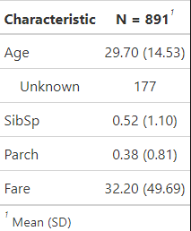{width="400"}

Based on the given value,

1.  Can be observed that the age mean is 27.90 (years) SD = 14.53 can show the more of distribute in range of age ,The above information makes it clear that there are passengers of various ages who come on board for whatever reason.
2.  SibSp mean = 0.52 SD =1.10 It shows that in boarding the ship this time, there were rarely a group of people who were related in terms of relatives boarding the ship together and Parch mean = 0.38 SD = 0.81 is can be interpreted in the same way
3.  Fare mean = 32.20 SD = 49.69 it show more of distribute in the range of fare because data classify by the 1st, 2nd, 3rd class of ticket passenger.

```{r}
perc <- choose %>% 
  tbl_summary( 
    by = Survived,
    missing = "no"
    ) %>%
  
  add_n() %>%
  modify_header(update = list(
    label ~ "**Variables**",
    stat_1 ~ "**No**, (N = 549)",
    stat_2 ~ "**Yes** (N = 342)")) %>%
  modify_spanning_header(c("stat_1", "stat_2") ~ "**Survived**") %>%
  bold_labels()
```

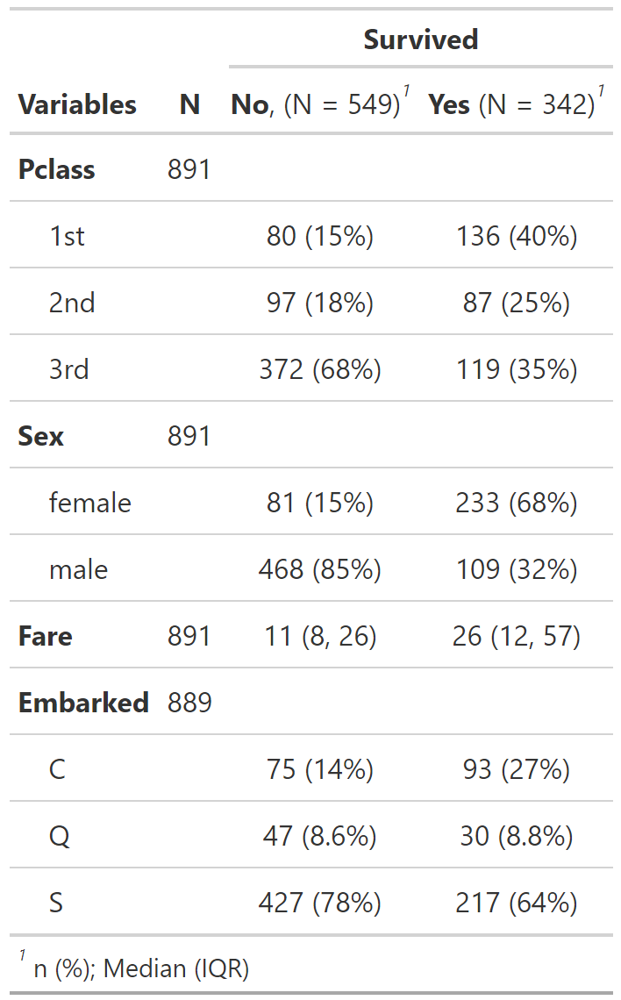{width="400"}

Table showing percent of survival relates with various variable

-   The survived for the incident which all of the passenger is 891 , and then the survived is 342, not survived is 549
-   Most of the passengers who died purchased third-class tickets.
-   there were more males than females on the boat, The proportion of males who died was also higher.

```{r}
qual <- train %>% select(Survived,Pclass,Sex,Embarked) 
# summarize into a table 
qual %>% tbl_summary( digits = list(all_categorical()~c(2,2)) )
```

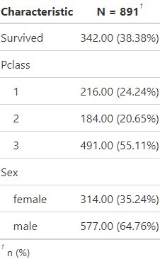{width="300"}

You can observe by this numerical presentation tell us that :

-   From 891 passengers just have 342 (38.38%) can survived from the incident.

-   The most of passenger buy third-class ticket (55.11%).

-   The number of male (64.76) who boarded the ship outnumbered the female (35.24).

## Built datafram about group interested data.

```{r built datafram names "sum",echo=TRUE}
sum <- train %>%
  select(Survived, Pclass, Sex, Age, SibSp, Parch, Fare, Embarked) %>%
  mutate(
    Pclass = case_when(Pclass == "1" ~ "1st",
                       Pclass == "2" ~ "2nd",
                       Pclass == "3" ~ "3rd")
    )
print(sum)
```

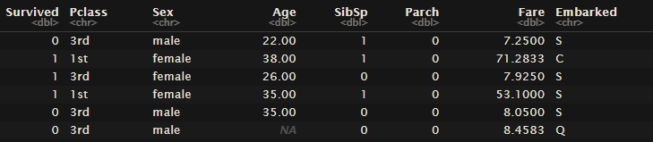

```{r built datafram names "choose"}
choose <- train %>%
  select(Survived, Pclass, Sex, Fare, Embarked) %>%
  mutate(
    Pclass = case_when(Pclass == "1" ~ "1st",
                       Pclass == "2" ~ "2nd",
                       Pclass == "3" ~ "3rd")
    )
```

```{r Calculate values from data in percentage form.}
train %>%
  count(Pclass) %>%
  mutate(sperc1 = round(n/sum(n)*100))
```

```{r Calculate values from data in percentage form.}
train %>%
  count(Sex) %>%
  mutate(sperc2 = round(n/sum(n)*100))

```

```{r plot bar graph}
gender <- train %>%
  group_by(Sex) %>%
  count(Survived)

ggplot(gender, aes(x = Sex, y = n, fill = as.factor(Survived))) +
  geom_bar(position="dodge", stat = "identity") +
  geom_text(aes(label = n), vjust = -0.5,
            position = position_dodge(width = 0.9)) +
  ylab("Count (n)") +
  labs(fill = "Survived") +
  scale_fill_manual(values = c("blue", "lightpink"),
                    label = c("Died","Survival" )) +
  scale_x_discrete(label = c("female" = "Female", "male" = "Male"))
```

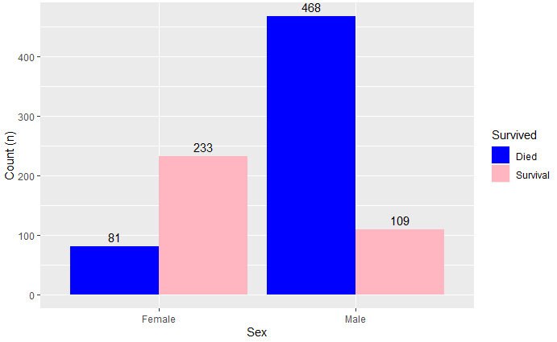{width="400"}

Fig 3 Because the number of males who board the boats is twice as many as females, the death rate among males is higher than that of females. which makes it known that in those days males often had opportunities in various things more than female.

```{r}
port <- train %>%
  group_by(Embarked) %>%
  count(Survived)
port <- na.omit(port)

ggplot(port, aes(x = Embarked, y = n, fill = as.factor(Survived))) +
  geom_bar(position = "dodge", stat = "identity") +
  geom_text(aes(label = n),vjust = -0.5, 
            position = position_dodge(width = 0.9)) +
  ylab("Count (n)") +
  labs(fill = "Survived") +
  scale_fill_manual(values = c("blue", "lightpink"),
                    label = c("Died","Survival" )) +
  scale_x_discrete(label = c("C" = "Cherbourg","Q" = "Queenstown",
                             "S" = "Southampton")) 

```

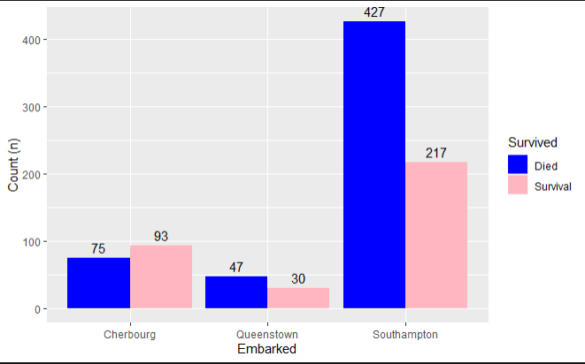{width="400"}

```{r calculation of the percentage of classes chosen by passengers.}
train %>%
  count(Pclass) %>%
  mutate(tpct = round(n/sum(n)*100))
```

```{r}
ticket <- train %>%
  group_by(Pclass) %>%
  count(Survived)

ggplot(ticket, aes(x = as.factor(Pclass), y = n, fill = as.factor(Survived))) +
  geom_bar(position = "dodge", stat = "identity") +
  geom_text(aes(label = n),vjust = -0.5, 
            position = position_dodge(width = 0.9)) +
  xlab("Pclass") +
  ylab("Count (n)") +
  labs(fill = "Survived") +
  scale_fill_manual(values = c("blue", "lightpink"),
                    label = c("Died","Survival" )) +
  scale_x_discrete(label = c("1" = "1st", "2" = "2nd", "3" = "3rd"))
```

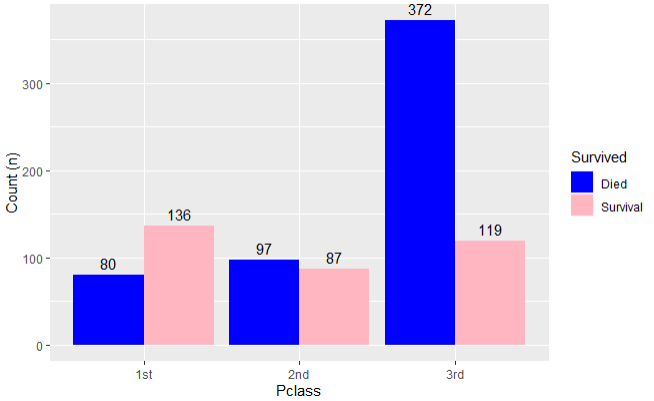{width="400"}

Fig 5 The graph shows the number of survivors and non-survivors. that have purchased tickets for all three classes ( first class,second class and third class) ,shows that most deceased people choose to purchase tickets in third class.

# Qualitative Attributes

Before that we examine the relationship between quantitative variables and passenger survival. There are four qualitative variables in the Titanic dataset that we can examine with statistics --- Survived, Pclass, Sex, Embarked. without regard to PassengerID, Name , Cabin and Ticket

```{r}
su <- c(549,342 )
labels <- c( "Not Survived (61.62%)","Survived (38.38%)")
pie(su,labels,radius = 1,main = "Survival state of 891 passengers",col =c("lightpink","lightblue"))
```

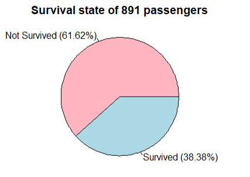{width="240"}

```{r}
gen <- c(314,577 )
labels <- c("Female (35.24%)", "Male (64.76%)")
pie(gen,labels,radius = 1,main = "Gender of 891 passengers",col =c("lightpink","lightblue",))
```

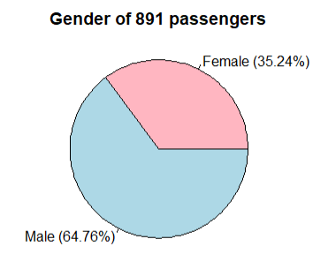{width="240"}

```{r}
cl <- c(216,184,491)
labels <- c("First-class (24.24%)", "Second-class (20.65%)","Third-class (55.11%)")
pie(cl,labels,radius = 1,main = "Ticket Class of 891 passengers",col =c("lightpink","lightblue","lightgreen"))
```

# 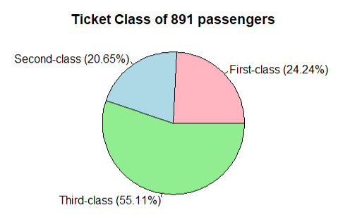{width="240"}

```{r}
e <- c(2,168,77,549 )
labels <- c("Unknown (0.22%)", "Cherbourg (18.86%)"," Queenstown (8.64%)","Southampton (72.28%)")
pie(e,labels,radius=1,main = "Embarkation port of 891 passengers",col =c("lightpink","lightblue","lightgreen","lightyellow"))
```

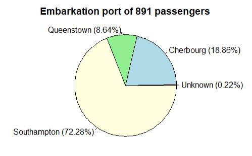{width="240"}

# Predictive analysis

```{r}
boxplot(train$Age ~ train$Survived, main = "Age Boxplot Comparison between survived and Died  ", col = "purple", border = "black", horizontal = T, notch = F )

```

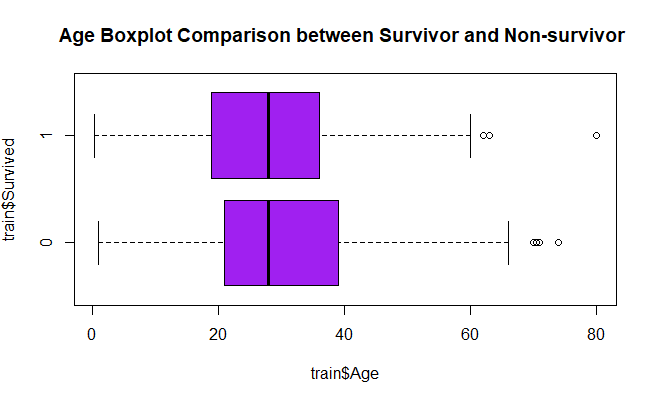{width="400"}

Fig 6 The boxplot graph is a comparison between the age and survival of the passengers. It shows that the ranges are quite similar. This makes it impossible to determine whether age had a significant relationship with the survival of people on the Titanic.

```{r}
sur <- subset(train, Survived==0)

dy <- subset(train, Survived==1)

with(sur, plot(Parch,SibSp,col="blue", xlim=c(0,8), ylim=c(0,8)))
with(dy, points(Parch,SibSp,col="black"))
```

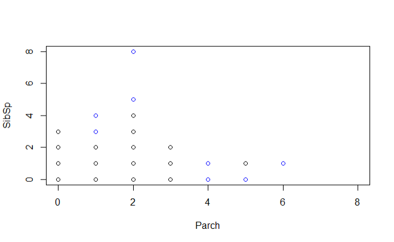{width="400"}

Fig 7 show the survivor is highlighted with blue dot, amplified by color, while the non-survivors are painted black.

-   if you look at the Parch axis, if a passenger has between one and three parents on board, they have a better chance of survival. Range greater than 3 or more because if there are a large number of family members The chance of helping is reduced and if you look at the SibSp axis, passengers with 1-2 siblings/spouses are more likely to survive. Because they will be helped by their lovers and brothers/sisters.

```{r compare about Age and Density }
life <- train %>%
  filter(!is.na(Age))

ggplot(life, aes(x = Age)) +
  geom_density(aes(fill = as.factor(Survived)), alpha = 0.6) +
  scale_fill_manual(values = c("blue", "lightpink"),
                    label = c("Died","Survival" )) +
  theme(legend.position = c(0.85, 0.55),
        legend.background = element_rect(fill = "white", 
                                         color = "black")) +
  xlab("Age (Years)") +
  ylab("Density") +
  labs(fill = "Survived")

```

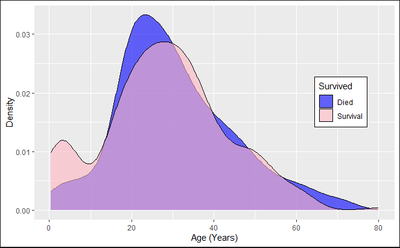{width="400"}

Fig 8 Shows the age distribution of passengers who survived compared to passengers who did not. The average age of both groups was 28 years (mean = 27.90 years). Passengers younger than 15 years had a higher chance of survival. It may indicate that children More likely to survive For passengers aged 10-30 years and older than 60 years, the number of passengers who survived was less.

```{r}
ggplot(train, aes(x = Fare)) +
  geom_histogram(aes(fill = as.factor(Survived)),alpha = 0.7) +
  scale_fill_manual(values = c("blue", "lightpink"),
                    label = c("Died","Survival" )) +
  theme(legend.position = c(0.7, 0.55)) +
  ylab("Survived") +
  labs(fill = "Survived") 
```

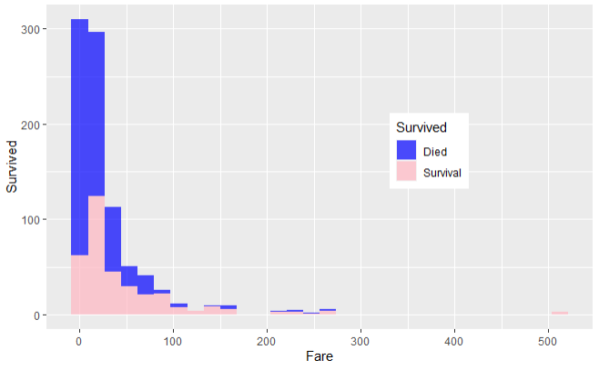{width="400"}

Fig 9 Graph showing the number of survivors relative to the ticket price for each tier, in the range 0 - £512.3292.

# Summary 

In this study, an attempt was made to get to know the information. Able to convey information in various formats to suit Because in choosing the format for presentation is also important. All available data is able to reflect the life and non-life history of the Titanic sinking.

I hope this is a good start for me and you who read this.

Thanks you, Soontarephan
